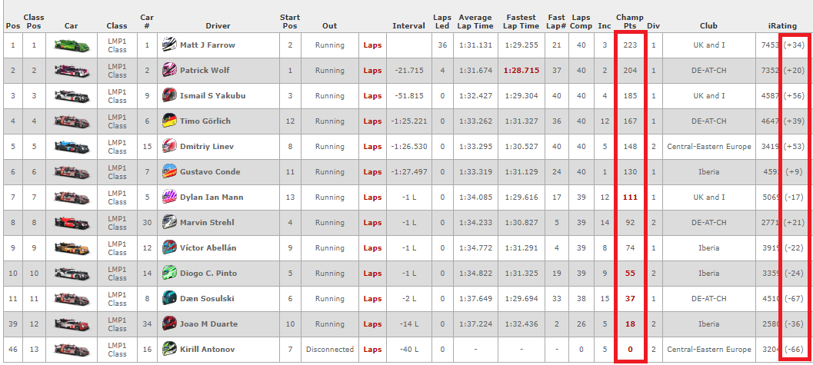
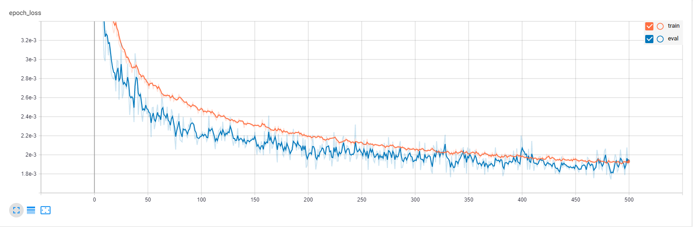
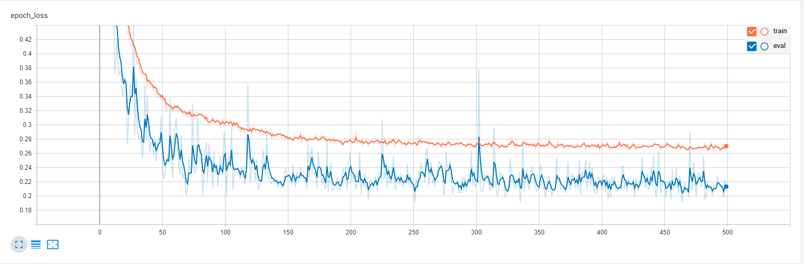
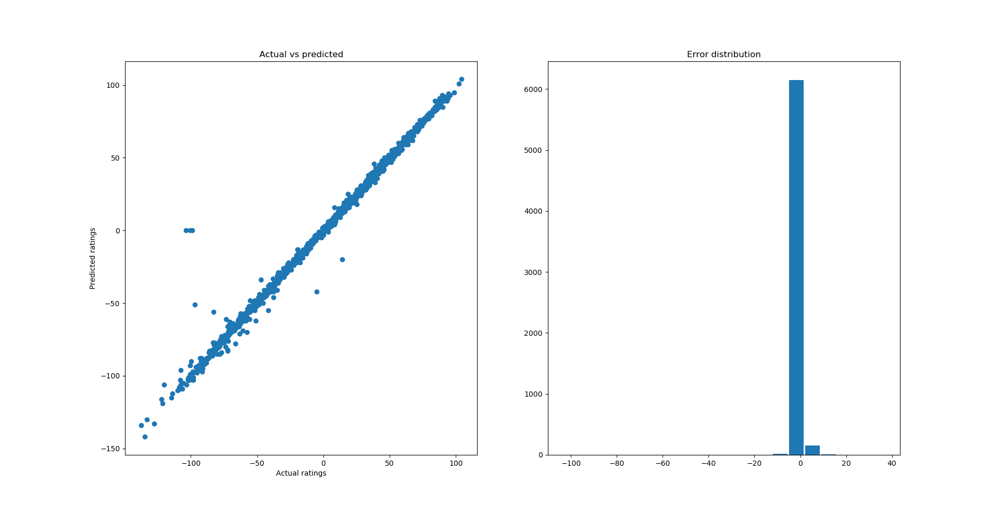
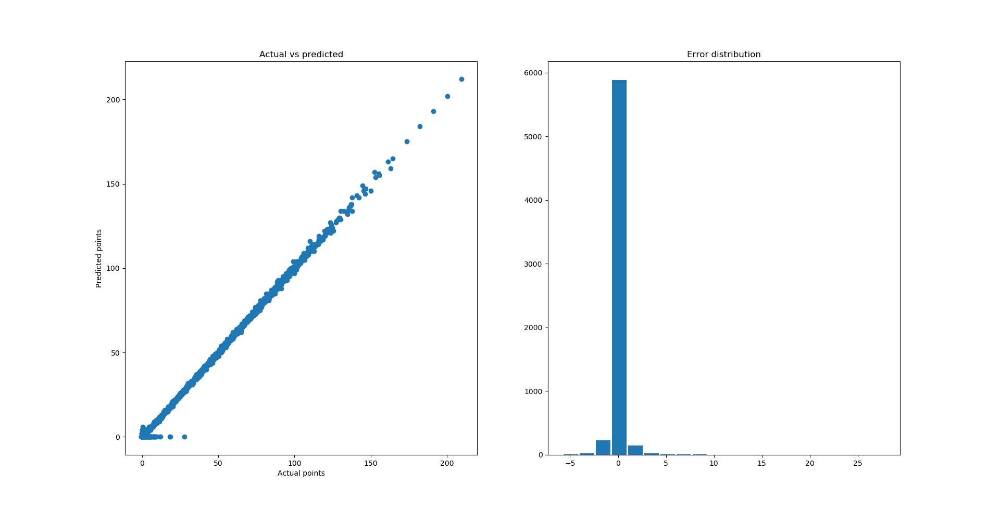

# Neural network for iRacing rating gain/loss and points prediction 

This project is my hello world for neural networks.

iRacing is a racing simulator I race and it uses rating system to match racers performance. If you finish a race in a high position, you gain iRating and if you finish a race in a low position you lose iRating. However, it is not that straightforward – an amount if rating you gain depends on ratings of drivers in front of you and behind you and an algorithm for this is unknown. After a race you also get championship points and formulae for amount of points is also unknown. Actually an algorithm for calculating iRating gain/loss leaked some time ago but I found interesting to train a neural network to predict rating changes and championship points.

This repo contains my code for neural network predicting iRating gain/loss and points awarded. Note that this repo does not contain data for training as long as a code for scraping this data wasn’t done by me.

## Neural network architecture

I'm using a simple perceptron with 64 input neurons, 2 hidden fully-connected layers with 256 neurons each and an output layer with 64 neurons. Input neurons contain rating for each driver as it stands in a finish protocol. For rating change each rating is divided by a race SOF (Strength of field).

## Training 

Training a single network for ratings or points (500 epochs) takes around 7 minutes on my laptop ASUS N550 with Intel core i7 4710HQ processor. As an input data I used around 10000 results of a single-class official sessions.

Training graph for 500 epochs for rating changes:

Training graph for 500 epochs for championchip points:

---

NN performance on a rating change prediction after 500 training epochs:

NN Performance on a championchip points prediction after 500 training epochs:

## License

This code is posted under MIT license

Copyright Dmitriy Linev 2020